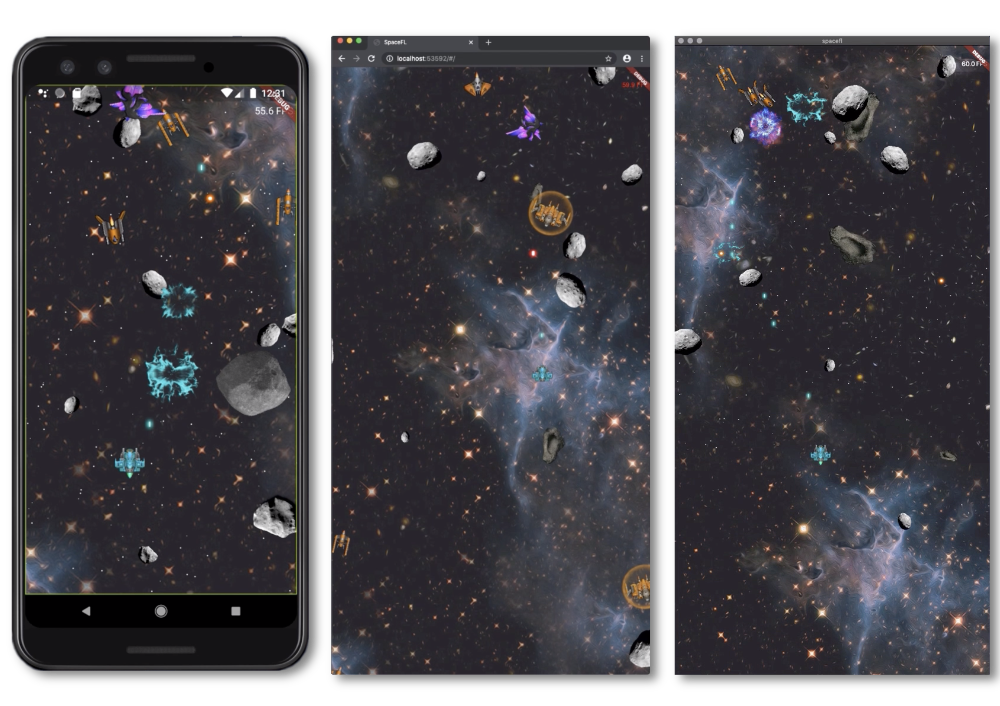

# SpaceFL
A simple tiny space game [originally written in JavaFX][1] by [Gerrit Grunwald (a.k.a hansolo_)][2]
and ported to Flutter and Dart.  I wanted to see if a (fairly) graphics intensive app really could run 
at 60 FPS on Android, iOS, web, and desktop; all from a single code base with no changes.

### Overview
All Flutter source code is in the [lib](lib) directory. Platform-specifc build files and source 
code lives in the [ios](ios), [android](android), [web](web), and [macos](macos) directories.

A few quick pointers to get you started: the [Game](lib/game/game.dart) singleton and its associated 
[GameState](lib/game/game_state.dart) class are where you should start if you want to get familiar with 
the code. The [actors](lib/game/actors) package contains all of the ships, torpedoes, explosions, etc.
There are also several [mixins](lib/game/actors/mixins) that provide common behaviors to the actors, such
as kinematics and hit testing.  The Flutter-specific bits are in the [lib/widgets](lib/widgets) package.
The [RenderGameBoard](lib/widgets/render_game_board.dart) class might be of particular interest if you
want to see how Flutter RenderObjects work.

### Youtube video
There is a short [video](https://www.youtube.com/watch?v=fk_6q-qR-Ns) that shows the game in action
in its mobile, web, and desktop incarnations.

### Getting Started with Flutter

A few resources to get you started if this is your first Flutter project:

- [Lab: Write your first Flutter app](https://flutter.dev/docs/get-started/codelab)
- [Cookbook: Useful Flutter samples](https://flutter.dev/docs/cookbook)

For help getting started with Flutter, view our
[online documentation](https://flutter.dev/docs), which offers tutorials,
samples, guidance on mobile development, and a full API reference.

[1]: https://github.com/HanSolo/SpaceFX
[2]: https://github.com/HanSolo
